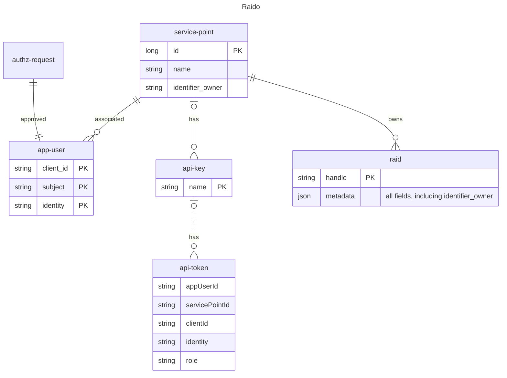

# Permission model

Note that this page documents the _**current**_ permission model of Raido, as at 
2023-05-29. 

## Limitations of current permission model 

The current permission model does not support the concept of users
from multiple organisations collaborating on a shared raid.

This is planned to be implemented with the new ORCID ID based permission model -  
which will included the concept of users editing raids across the boundaries 
between organisations and between regions (i.e. different registration-agents).  
That is, a user in one region: say a SURF-associated
University in the EU; editing a raid associated with a University managed in a
different region, say an ARDC-associated University in Australia.

## service-point

Currently every "user" of Raido, human or machine, is associated directly
to a service-point.  A service-point is a logical grouping of users and the 
raids that they maintain.  It does not correspond directly to the concept of 
"institution" or "organisation".  It is expected that a large university might
have many service-points, depending on how their staff is organised. 

Human users sign-in and request authorization for a service-point (which must
then be [manually approved](../security/access-control/authorization/unapproved-user-authz-request-flow.md)).

The "approval" for machine users is implied by the creation of the 
api-key - only `OPERATOR` or `SP_ADMIN` 
[role users](../security/access-control/authorization/role.md) can create/view 
api-keys.  Each api-key is associated with a service-point.

There is no distinct "institution" or "organisation" concept in this model.
Each service-point has an `identifier_owner`, which is a
[RoR](https://ror.org/) that identifies an organization (e.g. a specific 
University or other research organisation).

The `identifier_owner` of the service-point is used to to populate the 
`identifier_owner` field in the raid metadata when it is minted.  All 
service-points that are created for an organisation (e.g. a specific 
University) will be associated with the same RoR.

## raid

When a raid is minted, it is automatically associated with the service-point
of the user (human or machine) that minted it.

A user can only mint/edit or view closed raid data for the service-point they
are associated with.

Anybody in the world can see the metadata for an "open" raid by visiting the 
landing page - i.e. no authorization required, no need to sign in.

## api-key 

The api-key is stored in the DB.  The api-key `name` field serves to identify, 
for humans, the intended usage of that api-key. For example, you might create 
one api-key for integration of a custom client UI, and a separate 
api-key for a nightly batch or similar usage. Logically the two separate 
mechanisms could be consider separate "clients" and be given their own api-key.

## api-token

The api-token is not stored in the database, the api-token generation endpoint
creates the api-token and returns it to the caller, then the api-token is 
discarded. 
api-token exists in the diagram to give the context of the api-token being 
logically "owned" by the api-key, which is "owned" by the service-point.

The "members" of the api-token are not columns in a DB, they're the claims 
contained in the api-token.

Whenever Raido serves an API call, it first verifies that api-token is valid 
then checks the authorization rules for that call.  For example, in the case
of the "read raid endpoint", it confirms that the given api-key is associated 
with the same service-point that the request is trying to read, thus maintaining
the confidentiality of "closed" raids.

