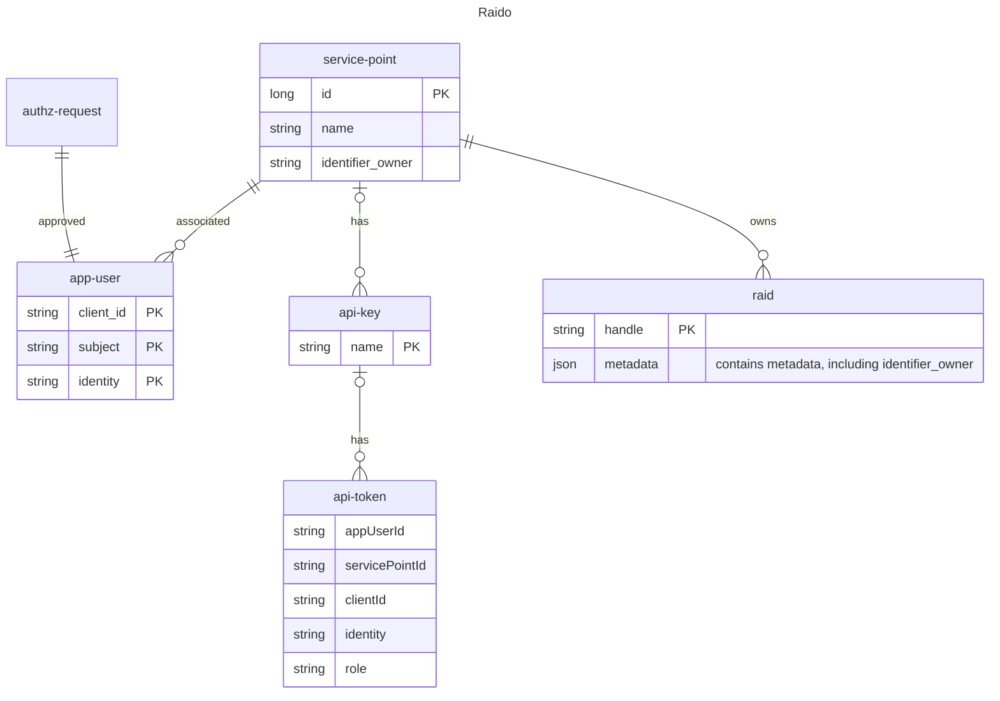

# Permission model

Note that this page documents the _**current**_ permission model of Raido, as at 
2023-05-29. 

## service-point

Currently, every user of Raido (either human or machine) is associated directly
to a service-point.

Human users sign-in and request authorization for a service-point (which must
then be manually approved).

The "approval" process for machine users is implied by the creation of the 
api-key - only OPERATOR or SP_ADMIN role users can create/view api-keys.  Each
api-key is associated with a service-point.

There is no "institution" entity in this model, each service-point has an
`identifier_owner`, which is a [RoR](https://ror.org/) that identifies an 
institution (e.g. a specific University or other research organisation).

The `identifier_owner` is used to to populate the `identifier_owner` in the 

## raid

When a raid is minted, it is automatically associated with the service-point
of the user (human or machine) that minted it.

A user can only mint/edit or view closed raid data for the service-point they
are associated with.

Anybody in the world can see the metadata for an "open" raid by visiting the 
landing page - i.e. no authorization required, no need to sign in.

## api-key 

The api-key is stored in the DB.  The api-key `name` field serves to identify, 
to humans, what the intent of that api-key is (for example, you might have
create one api-key for integration of a custom client UI, and a separate 
api-key for a nightly batch or similar usage - logically the two separate 
mechanisms could be consider separate "clients" and be given their own api-key.

## api-token

The api-token is not stored in the database, the api-token generation endpoint
creates it and returns the api-token to the caller, then discards the api-token. 
api-token exists in the diagram to give the context of the api-token being 
logically "owned" by the api-key, which is "owned" by the service-point.

The "members" of the api-token are not columns in a DB, they're the claims 
contained in the api-token.

Whenever Raido serves an API call, it first verifies the api-token is valid then
checks the authorization rules for that call.  For example, in the case
of the "read raid endpoint", it confirms that the given api-key is associated 
with the same service-point that the request is trying to read.

