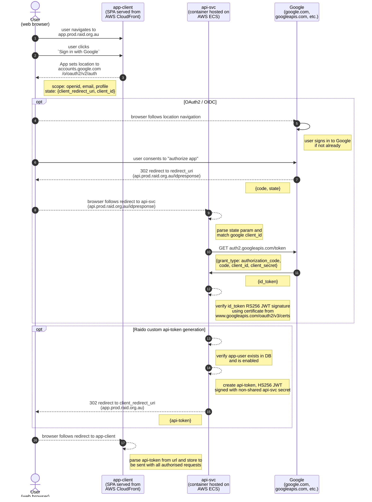

This documents a "happy day" sign-in process using Google as the ID Provider.

Assume:
* the user is already signed-in to google
* the app-user record
  * exists in DB because it was already approved by an OPERATOR or SP_ADMIN
  * is enabled and otherwise valid

Note:
* I have used Mermaid optional boxes (`opt`) to try to highlight and separate 
  the OAuth2 part of the process from the custom Raido part where we generate 
  our own api-token for use with API endpoint calls.  

* (3) `SignInContainer.tsx googleSignIn()`
* (9) `AppUserAuthnEndpoint.java authenticate()`
* (17) `AuthProvider.tsx checkLoginState`