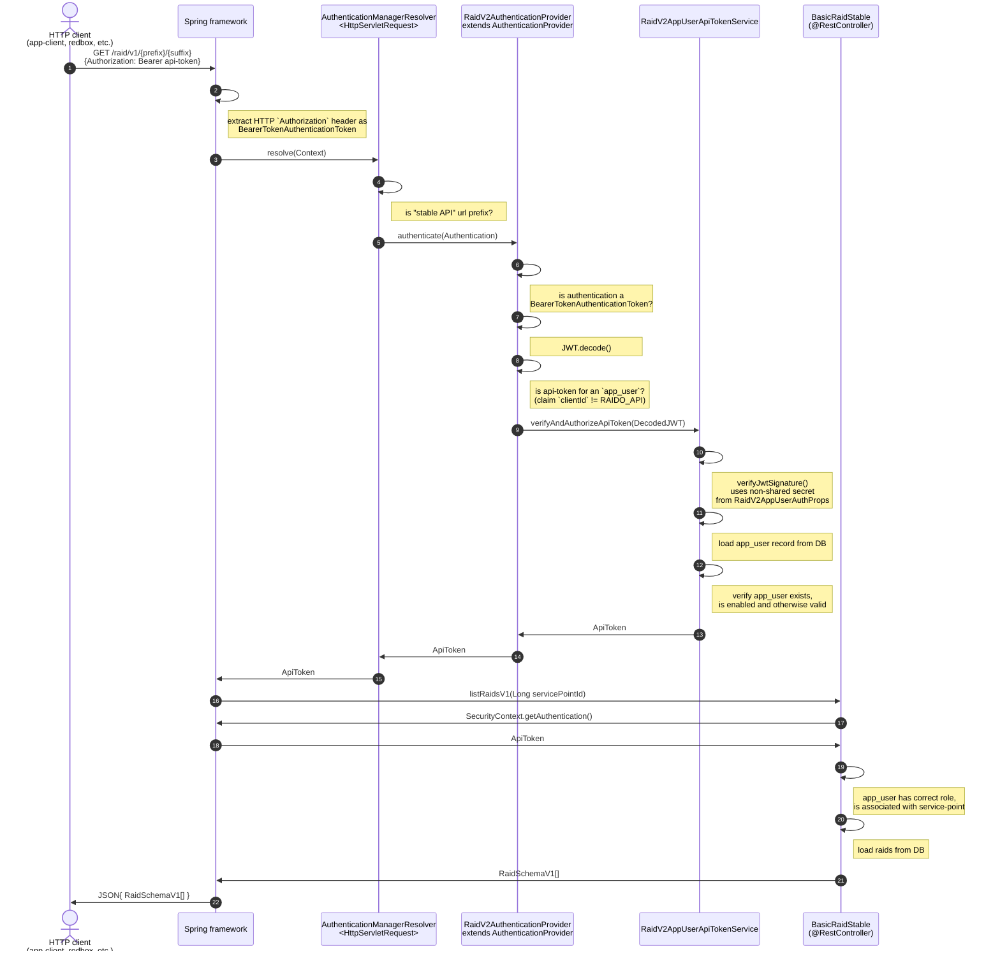

```mermaid
sequenceDiagram
autonumber
actor client as HTTP client<br/>(app-client, redbox, etc.)
participant spring as Spring framework
participant resolver as AuthenticationManagerResolver<br/><HttpServletRequest>
participant provider as RaidV2AuthenticationProvider <br/>extends AuthenticationProvider
participant apiTokenSvc as RaidV2AppUserApiTokenService
participant endpoint as BasicRaidStable<br/>(@RestController)

  client->>spring: GET /raid/v1/{prefix}/{suffix}<br/>{Authorization: Bearer api-token}

spring->>spring: .
  note right of spring: extract HTTP `Authorization` header as<br/>BearerTokenAuthenticationToken
spring->>resolver: resolve(Context)

resolver->>resolver: .
  note right of resolver: is "stable API" url prefix?
resolver->>provider: authenticate(Authentication)

provider->>provider: .
  note right of provider: is authentication a <br/>BearerTokenAuthenticationToken?

provider->>provider: 
  note right of provider: JWT.decode()

provider->>provider: 
  note right of provider: is api-token for an `app_user`?<br/>(claim `clientId` != RAIDO_API)

provider->>apiTokenSvc: verifyAndAuthorizeApiToken(DecodedJWT)

apiTokenSvc->>apiTokenSvc: .
  note right of apiTokenSvc:  verifyJwtSignature()<br/>uses non-shared secret<br/>from RaidV2AppUserAuthProps
  
apiTokenSvc->>apiTokenSvc: 
  note right of apiTokenSvc: load app_user record from DB<br/>
 
apiTokenSvc->>apiTokenSvc: 
  note right of apiTokenSvc: verify app_user exists,<br/>is enabled and otherwise valid
 
apiTokenSvc->>provider: ApiToken

provider->>resolver: ApiToken

resolver->>spring: ApiToken
  
spring->>endpoint: listRaidsV1(Long servicePointId)

endpoint->>spring: SecurityContext.getAuthentication()
spring->>endpoint: ApiToken

endpoint->>endpoint: .
  note right of endpoint: app_user has correct role,<br/>is associated with service-point

endpoint->>endpoint: 
  note right of endpoint: load raids from DB

endpoint->>spring: RaidSchemaV1[]

spring->>client: JSON{ RaidSchemaV1[] }
```