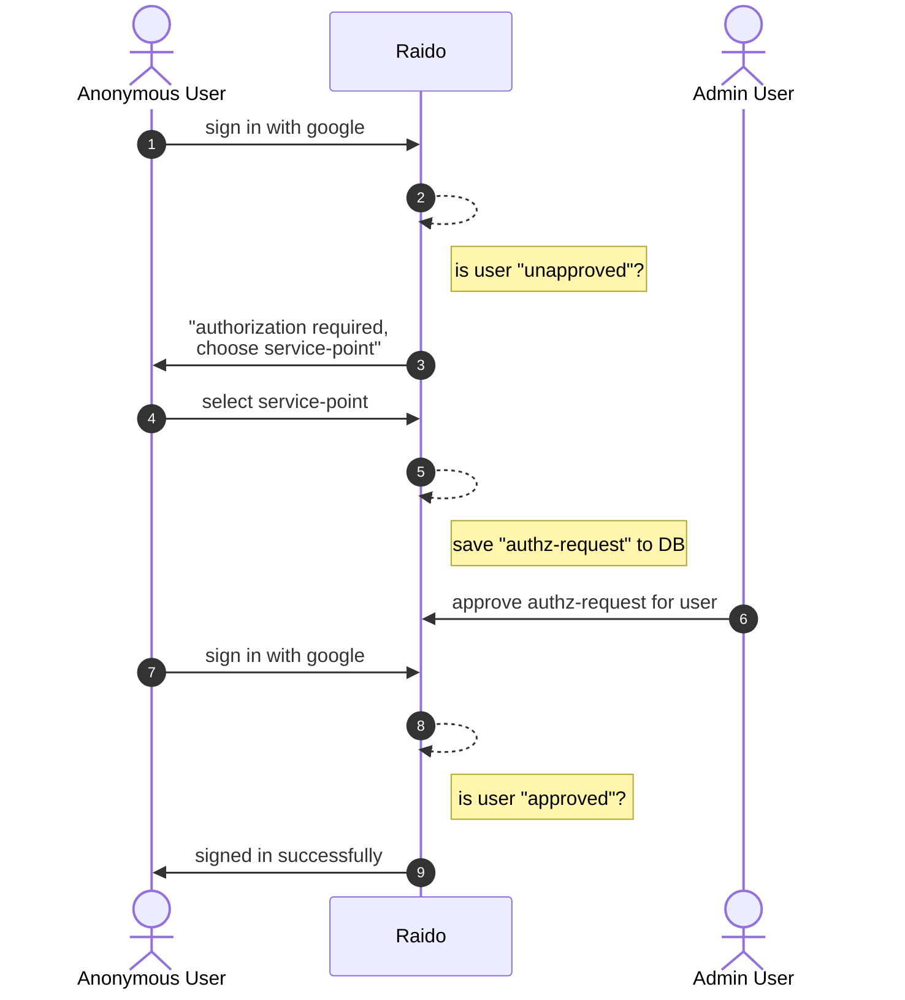

The content in this directory explains the various authorization concepts in 
Raido.

See [oauth2_api-token_exchange.md](../authentication/oauth2_api-token_exchange.md)
for details about how the actual sign-ing process works (OAuth2 / OIDC sign-in 
flow).

# Concepts

## `service-point`

The basic administrative unit, in Raido.

An institution might have many service-points that have separate agreements  
with the registration-agency.

For example, a large University  might have separate service-points, one for
their library department and one for their IT department.

Every service-point is associated with an institution via a
[RoR](https://ror.org/) which Raido stores as the identifier-owner for that
service-point.

Every raid that is minted in Raido is associated with a service-point that is
responsible for that data.

The service-point also defines who can edit (or see closed data of) a raid.

Theoretically, service-point is not a "RAiD" concept, the idea was created
for Raido, in order to have a base entity to associate with user roles and
raid data.

That said, every RAiD is minted in the context of a service-point (and
implicitly, an institution) and the responsible institution/service-point is
published in the Raido metadata in the `identifierServicePoint` and
`identifierOwner` fields of the
[`IdBlock`](/api-svc/idl-raid-v2/src/metadata-block.yaml).

The fields are published and documented in the "Raido" OpenAPI spec, but are
not currently part of the formal RAiD metadata schema specification.

## Authorization request - authz-request process for unapproved users

Before a user can use Raido, they must be approved to use the system by another
human who is responsible for administering the service-point.

See [app-user-authz-request-flow.md](./app-user-authz-request-flow.md) for a 
more detailed technical explanation of this process.

## `api-key`

The api-key is the entity that an OPERATOR or SP_ADMIN user creates (via the
app-client UI) to allow integration via the API.

See [api-key.md](./api-key.md)

## `api-token`

The api-token is the actual JWT that is sent with every API request as a
bearer token in the `Authorization` header for each HTTP request.

See [api-key.md](./api-key.md)

## `app-user`

app-user models the concept of a human user that has been approved to use 
Raido. 

See [app-user](./app-user.md)

## Role

Every api-key and app-user has a role associate with it, see
[role.md](./role.md).

