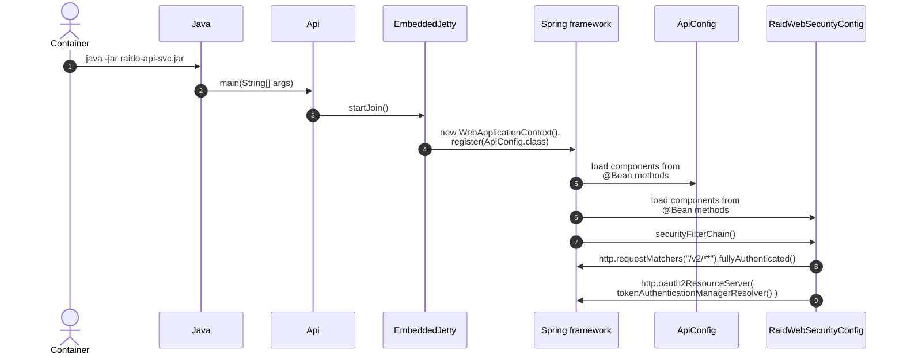

This diagram outlines how the 
[RaidWebSecurityConfig](/api-svc/spring/src/main/java/raido/apisvc/spring/config/RaidWebSecurityConfig.java)
is bootstrapped and the `AuthenticationManagerResolver()` method links to the 
[RaidV2AuthenticationProvider](/api-svc/spring/src/main/java/raido/apisvc/spring/security/raidv2/RaidV2AuthenticationProvider.java).

See [oauth2_api-token_exchange.md](../authentication/oauth2_api-token_exchange.md)
for details about how an app-user signs in and the app-client obtains an 
api-token.

See [api-token-authz-flow.md](./api-token-authz-flow.md) for details
of how Spring and the `RaidV2AuthenticationProvider` work to implement secured
endpoint calls.

