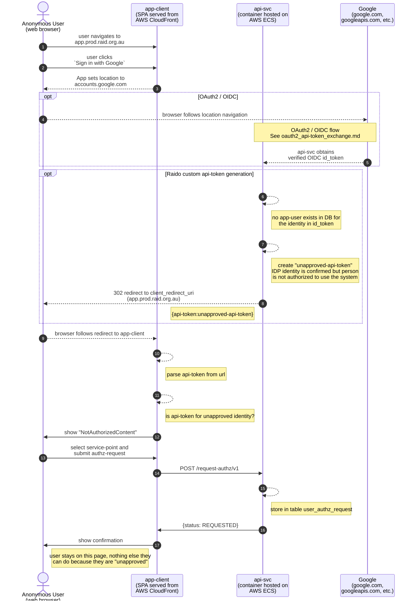
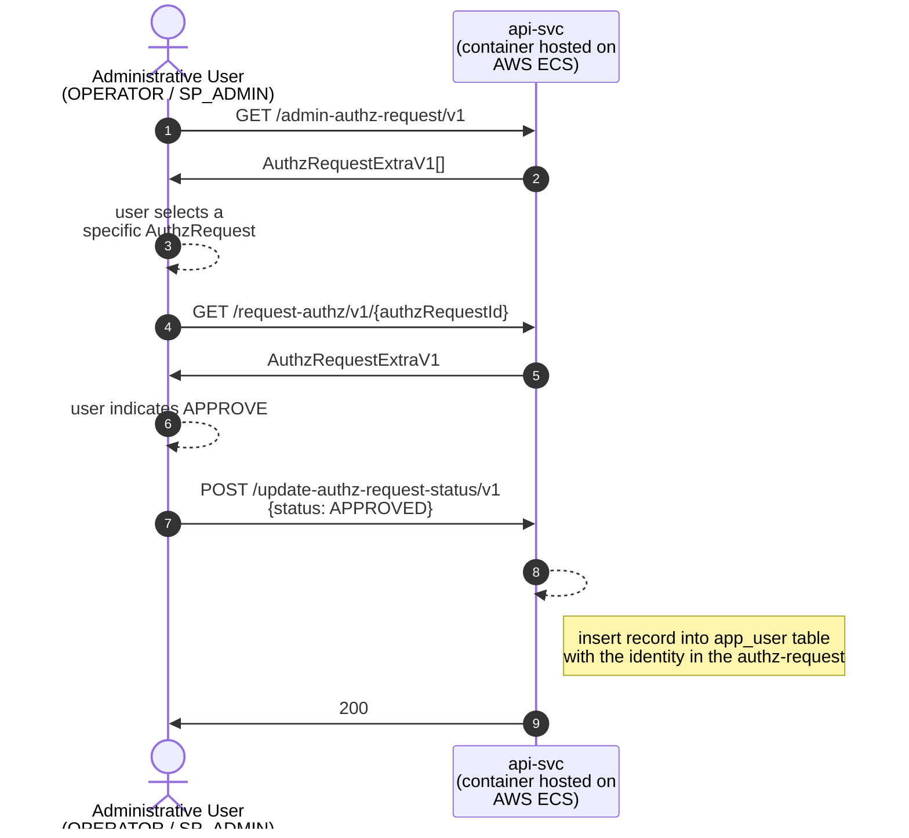

# Unapproved user sign-in flow 

This diagram shows the flow of requests for a new unapproved user signing in 
via Google and requesting access to Raid, including specifying what 
service-point they're associated with.

See [oauth2_api-token_exchange.md](../authentication/oauth2_api-token_exchange.md)
for details about how the OAuth2 / OIDC flow works.

In the below a "NonAuthzToken" might also be though of as an "UnapprovedToken", 
it identifies a person who has not been approved to use the system.

* (6?) `AppUserAuthnEndpoint.java authenticate()`
* (12?) `NotAuthorizedContent.tsx` Not modeled as a stand-along "page" (you 
  can't navigate to to it or anything)
  * it's just a component that the `AuthProvider` shows when this state is 
    detected

---

# Admin approval flow

This diagram shows the flow of requests involved when an administrative type
user (OPERATOR or SP_ADMIN) approves a user for using Raid at a service-point.

For this diagram, I'm only going to show the API calls, rather than drawing
out the app-client stuff that doesn't really add anything to the
understanding.  These API calls could easily be made by integrating a
customer's systems to allow approving from withing their own API client
application.

Note that all these API calls are fully secured and calls must be
accompanied by an api-token generated for a user with the suitable role.

After this process ends, the app-user is considered "approved" to use the RAiD
application in the context of the requested service-point.

The original requesting user just signs in again and
they will follow the normal sign-in scenario - an api-token will be
generated and returned to the app-client and the user is now "signed in".

See [oauth2_api-token_exchange.md](../authentication/oauth2_api-token_exchange.md)
for details about how the standard OAuth2 / OIDC flow works.

