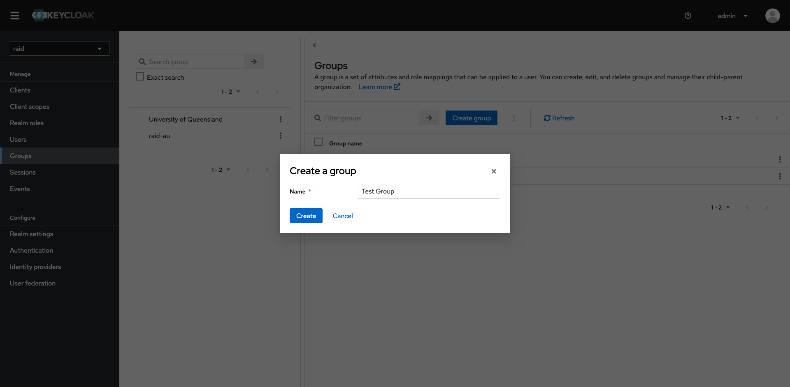
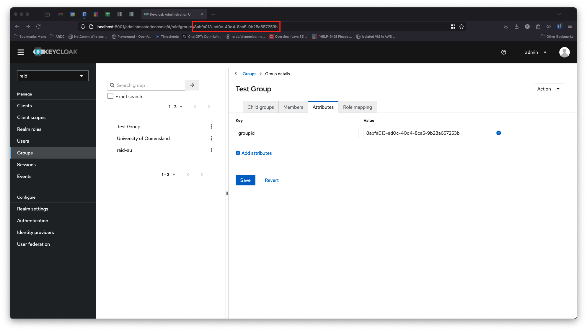
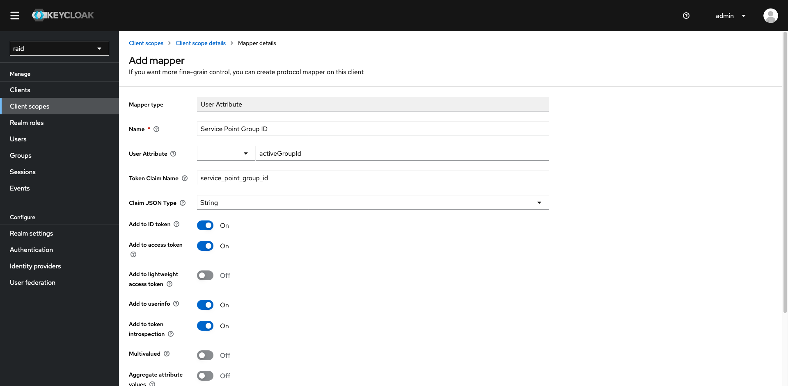
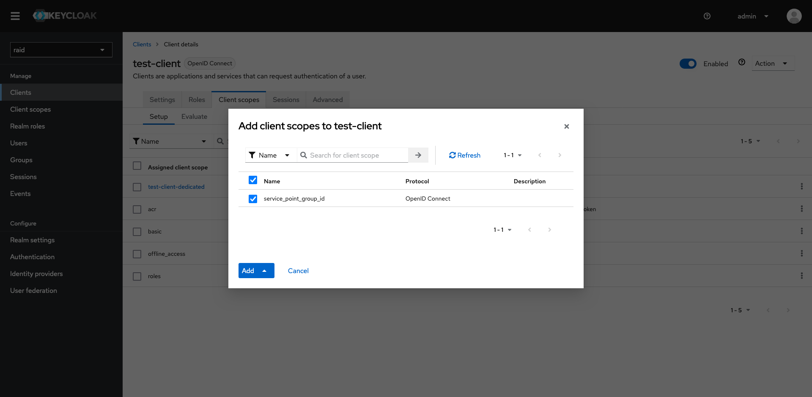
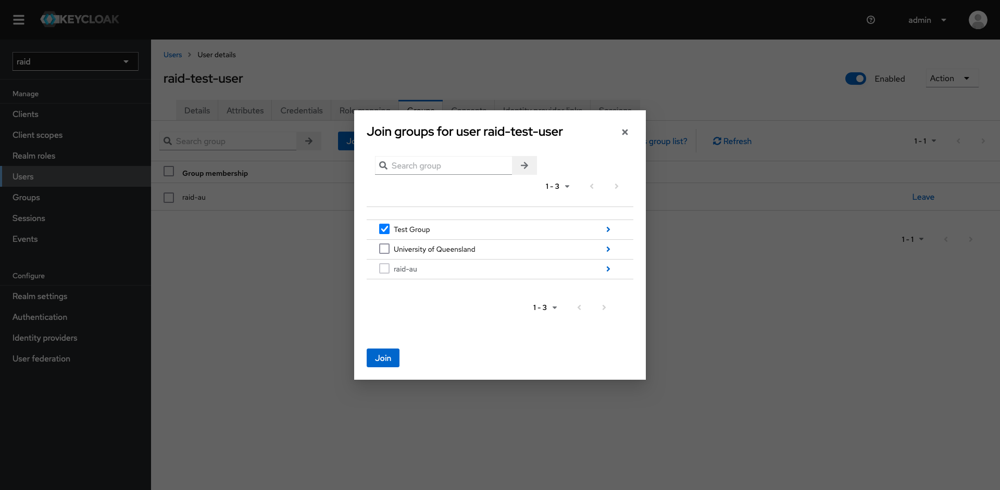

In order for a user to be able to mint raids they must be a member of a group in Keycloak and have access to repository in Datacite. In Raid, a Service Point connects the Keycloak group to a Datacite repository. In order for the API to identify the correct service point the access token must include the `service_point_group_id` claim. The user must also have the `service-point-user` role.

A user can belong to many Keycloak groups but when minting a Raid, the API needs to know which Datacite repository to store the Raid in. For this reason we have the concept of an 'active group'. This is the group that will map to a service point that is presented to the API at the point of minting. For users that belong to more than one group, the active group can be set in the Raid UI. Behind the scenes this sets the `activeGroupId` user attribute which is mapped to the `service_point_group_id` scope and sets the claim in the token.

To set set this up in Keycloak follow these steps...

## Create a group
* Click on 'Groups' then click on 'Create group'
* Enter a name for the group and click 'Create' 
* Click on the newly created group and select the 'Attributes' tab.
* Enter 'groupId' as the key and the id of the group (the UUID found in the URL in the address bar of your browser) as the value. Click 'Save' 

## Create the client scope
* Click 'Client scopes' and click 'Create client scope'
* Enter 'service_point_group_id' in the 'Name' field and click save
* Select the 'Mappers' tab and click 'Configure a new mapper'
* Click 'User Attribute'
* In the 'Name' field type 'Service Point Group ID'
* In the 'User Attribute' field type 'activeGroupId'
* In the 'Token Claim Name' type 'service_point_group_id'. Click 'Save' 

## Create a client (skip if you already have a client)
* Click on 'Clients' and click the 'Create client' button.
* Enter an id in the 'Client ID' field. Click 'Next'
* On the following screen accept all the default values and click 'Next'
* On the following screen leave the fields blank and click 'Save'

## Add the client scope to a client
* Click on 'Clients' then click on your client
* Select the 'Client scopes' tab then click on 'Add client scope'
* Select the checkbox next to 'service_point_group_id' and click 'Add' 

## Add your user to the group
* Click on 'Users' and select your user.
* Select the 'Groups' tag and click the 'Join Group' button
* Select the group and click 'Join' 

## Set active group
* Click 'Users' and select your user
* Select the 'Attributes' tab
* Click 'Add attributes'
* In the 'Key' field enter 'activeGroupId', in the value field enter the id of the group. Click 'Save'

## Request an access token
You can now request a token with the following command (replace values as necessary)
```
curl --location 'https://[your keycloak host]/realms/[your realm]/protocol/openid-connect/token' \
--header 'Content-Type: application/x-www-form-urlencoded' \
--data-urlencode 'client_id=[your client id]' \
--data-urlencode 'username=[your username]' \
--data-urlencode 'password=[your password]' \
--data-urlencode 'grant_type=password' \
--data-urlencode 'client_secret=[your client secret]'
```

You should be able to see 'service_point_group_id' claim in the token 

## Create a service point with the Keycloak group id
```
curl --location --globoff '{{scheme}}://{{host}}/service-point/' \
--header 'Content-Type: application/json' \
--header 'Authorization: Bearer {{token}}' \
--data-raw '{
    "name": "Raid AU",
    "repositoryId": "NPQS.RKFZRK",
    "prefix": "10.82841",
    "identifierOwner": "https://ror.org/038sjwq14",
    "password": "******",
    "adminEmail": "someone@example.org",
    "techEmail": "someone@example.org",
    "enabled": true,
    "appWritesEnabled": true,
    "groupId": "8abfa013-ad0c-40d4-8ca5-9b28a657253b" // Kneycloak group id
}'
```
