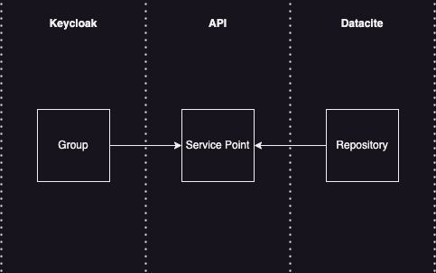

# RAID IAM (Keycloak)
## Table of Contents
* [Keycloak Service Provider Interfaces (SPIs)](#keycloak-service-provider-interfaces-spis)
    * [Groups](#groups)
        * [List Groups](#list-groups)
        * [List Group Members (Group Admin)](#list-group-members-group-admin)
        * [List Group Members (Operator)](#list-group-members-operator)
        * [Grant Permissions](#grant-permissions)
        * [Revoke Permissions](#revoke-permissions)
        * [Join Group](#join-group)
        * [Set Active Group](#set-active-group)
        * [List User Groups](#list-user-groups)
        * [User Roles](#user-roles)
        * [Client Roles](#client-roles)
        * [Groups](#groups)
        * [Set-up](#set-up)

## Keycloak Service Provider Interfaces (SPIs)

### Groups

#### List Groups
A list of all groups in the `raid` realm

```bash
Request:
    GET /realms/raid/group/all

Response: 
    Status: 200
    Content-type: application/json
    
    {
        "groups": [
            {
                "name": "raid-au",
                "attributes": {
                    "groupId": [
                        "169bd3f3-dd42-4ac0-b89a-fb49648e5eff"
                    ]
                },
                "id": "169bd3f3-dd42-4ac0-b89a-fb49648e5eff"
            },
            {
                "name": "University of Queensland",
                "attributes": {
                    "groupId": [
                        "ba0b01a6-726f-464f-b501-454a10096826"
                    ]
                },
                "id": "ba0b01a6-726f-464f-b501-454a10096826"
            }
        ]
    }

```
#### List Group Members (Group Admin)
List the members of the user's group. Requires `group-admin` role.

```bash
Request:

    GET /realms/raid/group/

Response:
    Status: 200
    Content-type: application/json

    {
        "members": [
            {
                "roles": [
                    "group-admin",
                    "service-point-user",
                    "default-roles-raid"
                ],
                "attributes": {
                    "firstName": [
                        null
                    ],
                    "lastName": [
                        null
                    ],
                    "activeGroupId": [
                        "169bd3f3-dd42-4ac0-b89a-fb49648e5eff"
                    ],
                    "email": [
                        null
                    ],
                    "username": [
                        "raid-au-group-admin"
                    ]
                },
                "id": "6868f0b9-6301-47b0-9cc5-20ef74396d8b"
            },
            {
                "roles": [
                    "default-roles-raid"
                ],
                "attributes": {
                    "firstName": [
                        null
                    ],
                    "lastName": [
                        null
                    ],
                    "email": [
                        null
                    ],
                    "username": [
                        "user1"
                    ]
                },
                "id": "570a3276-299a-488e-ae11-585b1a5216e3"
            },
        ],
        "name": "raid-au",
        "attributes": {
            "groupId": [
                "169bd3f3-dd42-4ac0-b89a-fb49648e5eff"
            ]
        },
        "id": "169bd3f3-dd42-4ac0-b89a-fb49648e5eff"
    }

```
#### List Group Members (Operator)
List the members of a specified group. Requires `operator` role.

```bash
Request:
    GET /realms/raid/group/?groupId=169bd3f3-dd42-4ac0-b89a-fb49648e5eff

Response:
    Status: 200
    Content-type: application/json
    
    {
        "members": [
            {
                "roles": [
                    "group-admin",
                    "service-point-user",
                    "default-roles-raid"
                ],
                "attributes": {
                    "firstName": [
                        null
                    ],
                    "lastName": [
                        null
                    ],
                    "activeGroupId": [
                        "169bd3f3-dd42-4ac0-b89a-fb49648e5eff"
                    ],
                    "email": [
                        null
                    ],
                    "username": [
                        "raid-au-group-admin"
                    ]
                },
                "id": "6868f0b9-6301-47b0-9cc5-20ef74396d8b"
            },
            {
                "roles": [
                    "default-roles-raid"
                ],
                "attributes": {
                    "firstName": [
                        null
                    ],
                    "lastName": [
                        null
                    ],
                    "email": [
                        null
                    ],
                    "username": [
                        "user1"
                    ]
                },
                "id": "570a3276-299a-488e-ae11-585b1a5216e3"
            },
        ],
        "name": "raid-au",
        "attributes": {
            "groupId": [
                "169bd3f3-dd42-4ac0-b89a-fb49648e5eff"
            ]
        },
        "id": "169bd3f3-dd42-4ac0-b89a-fb49648e5eff"
    }

```

#### Grant permissions
Grant permissions to create RAiDs and read and edit all RAiDs for a given service point. Grants the `service-point-user` role. User must already be a member of the same group as the group admin.
```bash
Request:
    PUT /realms/raid/group/grant
    
    {
        "userId": "466a8eab-6325-49aa-ab34-ff7b62213c53",
        "groupId": "169bd3f3-dd42-4ac0-b89a-fb49648e5eff"
    }

Response:
    Status: 200
    Content-type: application/json

    {
      
    }
```

#### Revoke permissions
Revokes the `service-point-user` role from the user.
```bash
Request:
    PUT /realms/raid/group/revoke
    
    {
        "userId": "466a8eab-6325-49aa-ab34-ff7b62213c53",
        "groupId": "169bd3f3-dd42-4ac0-b89a-fb49648e5eff"
    }

Response:
    Status: 200
    Content-type: application/json
    
    {
      
    }
```

#### Join Group
Allows the user to join a group. Does not grant read or write permissions.
```bash
Request:
    PUT /realms/raid/group/join
    
    {
        "groupId": "169bd3f3-dd42-4ac0-b89a-fb49648e5eff"
    }

Response:
    Status: 200
    Content-type: application/json
    
    {
    
    }
```

#### Set Active Group
Set the active group of the user. If a user belongs to more than one group this will determine what service point new raids are minted for.
```bash
Request:
    PUT /realms/raid/group/ative-group
    
    {
        "activeGroupId": "169bd3f3-dd42-4ac0-b89a-fb49648e5eff"
    }

Response:
    Status:200
    Content-type: application/json
    
    {
      
    }
    
```

#### List User Groups
Get a list of groups the user belongs to.
```bash
Request:
    GET /realms/raid/group/user-groups
    
Response:
    Status:200
    Content-type: application/json

    [
        {
            "id": "169bd3f3-dd42-4ac0-b89a-fb49648e5eff",
            "name": "raid-au"
        }
    ]
    
```

### RAiD Permissions

Set permissions on individual RAiDS

#### Grant Read/Write Permissions
Grant read/write permissions on a RAiD to an individual user regardless of service point.
```bash
Request:
    POST /realms/raid/raid/raid-user
    
    {
        "userId": "169bd3f3-dd42-4ac0-b89a-fb49648e5eff",
        "handle": "10.82841/01b6a883"
    }
    
Response:
    Status:200
    Content-type: application/json

    {

    }
    
```

#### Revoke Read/Write Permissions
Revoke read/write permissions on a RAiD from an individual user.
```bash
Request:
    DELETE /realms/raid/raid/raid-user
    
    {
        "userId": "169bd3f3-dd42-4ac0-b89a-fb49648e5eff",
        "handle": "10.82841/01b6a883"
    }
    
Response:
    Status:200
    Content-type: application/json

    {

    }
    
```

#### Grant RAiD Admin Permissions
A RAiD Admin can create/edit/read RAiDs for a given service point but cannot read embargoed RAiDs created by other users unless added a `raid-user`. 
```bash
Request:
    POST /realms/raid/raid/raid-admin
    
    {
        "userId": "169bd3f3-dd42-4ac0-b89a-fb49648e5eff"
    }
    
Response:
    Status:200
    Content-type: application/json

    {

    }
    
```

#### Revoke RAiD Admin Permissions
Revoke `raid-admin` permissions from a user.
```bash
Request:
    DELETE /realms/raid/raid/raid-admin
    
    {
        "userId": "169bd3f3-dd42-4ac0-b89a-fb49648e5eff"
    }
    
Response:
    Status:200
    Content-type: application/json

    {

    }
    
```

## User Roles
| Role               | Create Raids | Edit Raids | Read Embargoed Raids  | Create Service Points  | Add Users  |
|:-------------------|:------------:|:----------:|:---------------------:|:----------------------:|:----------:| 
| Operator           |       ❌     |     ❌     |           ❌|           ✅            |     ✅      |
| Group Admin        |         ❌     |❌            |❌                       |❌                        |✅            |
| Service Point User |      ✅       |     ✅      |           ✅           |           ❌            |     ❌      |
| Raid Admin *       | ✅| ✅ | ✅ | ❌ | ❌ |
| Raid User *       | ❌             |✅            |✅                       |❌                        |❌            |
 * Raid Admins can only edit Raids they have created. Can only read embargoed Raids if they created them.
 * Raid Users can only read and edit raids they have been invited to.


## Client Roles
| Role | Description                                          | 
|---|------------------------------------------------------|
| raid-permissions-admin | Creates Raid Users once invitation has been accepted |


## Groups

A group is a collection for users that can create Raids on a given service point. A group has a 1 to 1 relationships with a service point. Likewise a service point in Raid has a 1 to 1 relationship with a Repository in Datacite. 



## Set-up


When running locally with Docker Compose, the `raid` realm should be added automatically when the container starts.

The realm includes 2 test users `raid-test-user` and `uq-test-user`, each belonging to different service points. They 
both have the `service-point-user` role necessary to mint RAiDs. Both have the password 'password'. 

If you make any changes to the realm and want to save them to the configuration, run the command...
```
docker exec -it [container-id] bin/kc.sh export --realm raid --file /opt/keycloak/data/import/local-raid-realm.json
```
and commit the changes.

See https://www.keycloak.org/server/importExport